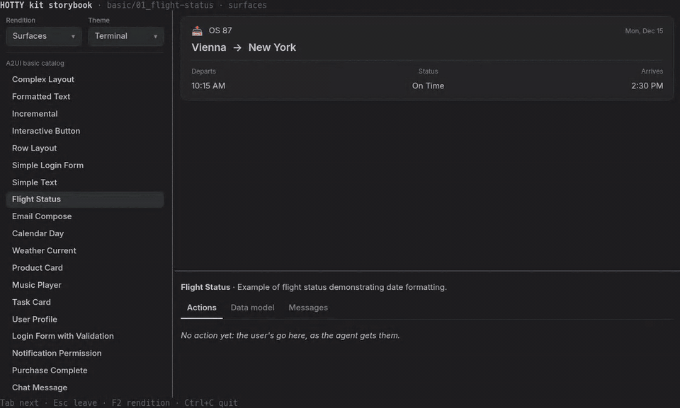

<div align="center">

# hotty-a2ui

**Describe a UI once. Get it as HTML in the terminal, in cells, or as plain text.**

HOTTY's UI kit on [A2UI](https://github.com/google/A2UI) v1.0, in Go.

[](LICENSE)
[](go.mod)
[](https://github.com/google/A2UI)
[](https://github.com/neuroplastio/hotty)
[](#status)

[**▶ Try it in your browser**](https://hotty.neuroplast.io/storybook) ·
[The HOTTY profile of A2UI](docs/profile.md) ·
[hottyterm](https://github.com/neuroplastio/hottyterm)



</div>

## Why

An agent, or any program, that speaks [A2UI](https://github.com/google/A2UI)
sends a tree of components and a data model, and hears back what the user
did. hotty-a2ui renders that tree in a terminal, three ways, from the same
state:

| | Rendition | Where | What you get |
| --- | --- | --- | --- |
| 🖥️ | **Surfaces** | a [HOTTY](https://github.com/neuroplastio/hotty) host: [hottyterm](https://github.com/neuroplastio/hottyterm), or xterm.js with [xterm-addon-hotty](https://github.com/neuroplastio/xterm-addon-hotty) | real HTML the terminal lays out among its cells, kept current with small deltas; keys, focus and clicks come back as the user's actions |
| 🔲 | **Cells** | any terminal | the same tree laid out and painted in character cells, with the keyboard and the mouse |
| 📄 | **Text** | a pipe | plain text, for logs and for agents that read |

Side by side, both interactive renditions take input: type in the surface
and the cells beside it follow, and the other way round.

## Highlights

- ⚙️ **A complete A2UI v1.0 core**: the data model, expressions and functions,
  catalogs checked against the spec's JSON Schemas, and the message
  processor with the agent's function calls. It runs A2UI's own conformance
  suites.
- 🧩 **Every basic component, in every rendition.** A2UI's 40-odd examples
  are the storybook's stories.
- ⌨️ **Keys and focus as HOTTY's SPEC §10**: one set of vectors runs against
  both the cells and the HTML rendition.
- 🔌 **A hotty catalog**, through A2UI's extension points only:
  `HottyShortcut`, `HottyForm`, `HottyProgress`, `HottySpinner`,
  `HottyTable`, `hottyFocus`, `hottyBlur`, autofocus and keys. Its names carry the prefix
  so that none can be one A2UI adds later.
- 🎨 **Seven themes**: Terminal, Material dark and light, Nord, Dracula,
  Gruvbox and Solarized light.
- 🛟 **Fallbacks** for what a terminal can't show: images, video, a
  component that contains itself, a child still to come.
- 📚 **A storybook made with the kit**: its list of stories and its panel of
  actions, data model and messages are A2UI surfaces too.

## Quick start

```sh
go install github.com/neuroplastio/hotty-a2ui/cmd/storybook@latest
storybook
```

It shows HTML surfaces in [hottyterm](https://github.com/neuroplastio/hottyterm)
(`brew install --cask neuroplastio/tap/hottyterm`, or `hottyterm-bin` from
the AUR), and draws in cells in any other terminal. No install at all:
[hotty.neuroplast.io/storybook](https://hotty.neuroplast.io/storybook) runs
it in the browser.

```sh
storybook basic/36_modal                         # one story (storybook -list names them)
storybook -theme dracula                         # in a theme
storybook -text basic/36_modal                   # as plain text
agent | storybook -stream - -out actions.jsonl   # what an agent streams, and the user's actions back
storybook -html basic/06_music-player            # the document a HOTTY host gets
storybook -bare hotty/keys                       # a story's surfaces alone, in cells
```

| Key | |
| --- | --- |
| <kbd>Tab</kbd> | through the story, then the panel and the list |
| <kbd>Esc</kbd> | leave a field, close a modal |
| <kbd>F2</kbd> | surfaces, cells, text, or surfaces beside cells |
| <kbd>F3</kbd> | the next theme |
| <kbd>F4</kbd> | the fields' keys: Bubble Tea's (<kbd>Ctrl</kbd>+<kbd>A</kbd>, <kbd>Alt</kbd>+<kbd>B</kbd>, <kbd>Ctrl</kbd>+<kbd>W</kbd>…), or HOTTY's defaults alone |
| <kbd>Ctrl</kbd>+<kbd>C</kbd> | quit |

## The storybook in your program

The storybook is a package too. A Bubble Tea program that speaks HOTTY with
[hotty-go](https://github.com/neuroplastio/hotty-go) shows it in a part of its
screen, as [hotty-demo](https://hotty.neuroplast.io/apps) does:

```go
book := storybook.New(storybook.Options{Prefix: "sb-"}) // surfaces named sb-…

// Update, after the hottytea.Session's own Update:
book.Update(msg, session)

// View: the Book's cells for the rectangle, and its surfaces there.
cells, surfaces := book.View(hottytea.Rect{X: 0, Y: 1, W: w, H: h - 2}, session)
session.Layout(append(mine, surfaces...))
book.LaidOut(session) // a surface's autofocus, once its document is out
```

## What's inside

| Path | What |
| --- | --- |
| [`docs/profile.md`](docs/profile.md) | the HOTTY profile of A2UI, a draft: renditions, keys and focus, the hotty catalog, fallbacks |
| [`a2ui/`](a2ui) | an A2UI v1.0 core in Go: the data model, expressions and functions, catalogs checked against the spec's JSON Schemas, node resolution, and the message processor with the agent's function calls |
| [`catalog/basic/`](catalog/basic) | A2UI's basic catalog, its functions implemented (en-US formatting) |
| [`catalog/hotty/`](catalog/hotty) | the hotty catalog: `HottyShortcut`, `HottyForm`, `HottyProgress`, `HottySpinner`, `HottyTable`, `hottyFocus`, `hottyBlur` |
| [`view/`](view) | the renderer's model of a surface: its nodes made into a few kinds of element, with the renderer's own state (focus, the tab shown, the modal open), and the controller the user's acts go through |
| [`rendition/html/`](rendition/html) | surfaces on a HOTTY host: a document, then deltas, and the host's events back as the user's acts |
| [`rendition/cells/`](rendition/cells) | cells in a terminal that is not a host, laid out by the profile's rules (§3), with keys and clicks as SPEC §10 has them |
| [`rendition/text/`](rendition/text) | plain text for a pipe |
| [`rendition/theme/`](rendition/theme) | the themes both renditions paint with: colours by role, and the shapes on a host |
| [`vectors/`](vectors) | keys and focus: one set of vectors, run against the cells rendition and the HTML one on a host |
| [`conformance/`](conformance) | A2UI's conformance suites, run against the core |
| [`story/`](story) | the stories (A2UI's basic examples, the hotty catalog's, the fallbacks), and a story as it runs |
| [`storybook/`](storybook) | the storybook, for a program to show in a part of its screen |
| [`cmd/storybook/`](cmd/storybook) | the storybook on the whole screen, as plain text in a pipe, or a story's HTML |
| [`ref/`](ref) | what the kit is held against: Bubble Tea's bubbles, huh and lipgloss, with the kit's stories' content (a module of its own) |
| [`vault/`](vault/README.md) | the work: the gap analysis, the board, questions and the journal |
| [`third_party/a2ui/`](third_party/a2ui) | A2UI at one commit ([`REV`](third_party/a2ui/REV)): the v1.0 schemas, the basic catalog and its examples, the conformance suites |

## Develop

```sh
mise install
make check   # gofmt, go mod tidy, vet, staticcheck, and the tests with -race
```

The tests run A2UI's conformance suites from `third_party/a2ui`: every v1.0
case of the core's suites, a few translated from v0.9's vocabulary. Each case
or suite left out says why (`conformance/`: the `*Skips` maps and
`outOfScope`), and a new pin that adds a suite fails the gate until a test
runs it or says why not.

A2UI is pinned at one commit and refreshed by hand. The script copies only
what the kit and its tests read:

```sh
make a2ui REV=<full A2UI commit>
```

`make shot NAME=form` sets Bubble Tea's component beside the kit's story,
both in the same terminal, as one picture in `.shots/form.png`
(`bin/ref -list` names them). It needs vhs and ImageMagick.

`make gif` records the GIF above again. It drives the storybook in xterm.js
with Playwright, from a checkout of
[xterm-addon-hotty](https://github.com/neuroplastio/xterm-addon-hotty)
(`ADDON`), and needs ffmpeg.

## Status

A proof of concept: a draft with no release, whose API changes freely. The
[HOTTY profile](docs/profile.md) it proves is a draft as well.

## License

Apache-2.0 ([`LICENSE`](LICENSE)). A2UI is Apache-2.0 too
([`third_party/a2ui/LICENSE`](third_party/a2ui/LICENSE)).
